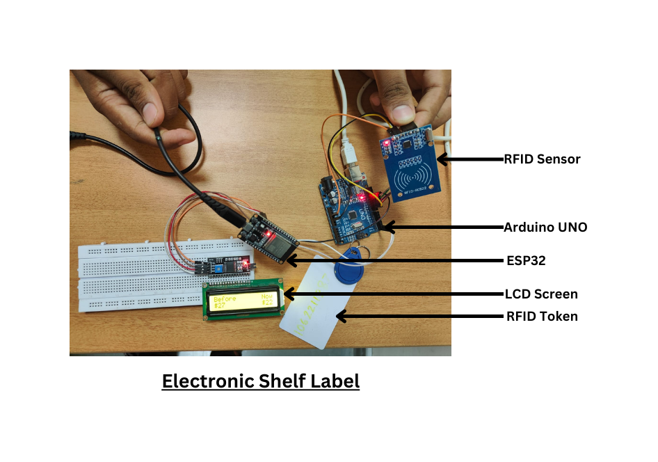
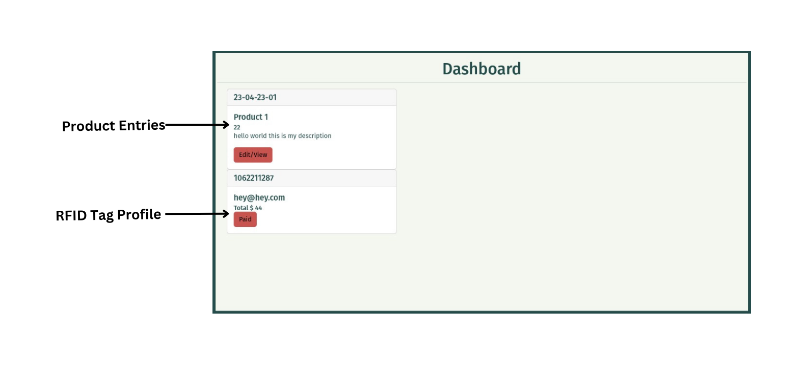

# Electronic Shelf Label (ESL) Project

## Overview

The Electronic Shelf Label (ESL) project aims to streamline and enhance the retail shopping experience by addressing common challenges faced by customers in hypermarkets and departmental stores. The primary issues include manual updating of prices and offers, leading to customer frustration, and long checkout lines.

## Images

### ESL

### Web Interface for the owner

## Key Features

- **Real-time Price Updates**: Automatic and instant updates of product prices and offers.
- **Efficient Shopping Experience**: Reduction of checkout waiting times through ESL and RFID technology.
- **Improved Customer Satisfaction**: Minimization of ambiguities in offers and prices.
- **Environmentally Friendly**: Decreased paper consumption due to automated updates.

## Why ESL?

Traditional retail settings often involve manual processes, leading to inefficiencies and customer dissatisfaction. ESL offers a technological solution, reducing human errors, improving operational efficiency, and enhancing the overall shopping experience.

## Where ESL Can Be Used

ESL is applicable in various retail environments, including:

- Hypermarkets
- Departmental Stores
- Supermarkets

## Future Scope

The project has the potential to scale into a comprehensive service, incorporating multiple screens and RFID for each product. Additionally, there is an opportunity to establish local servers and introduce partial smart shopping services, further contributing to the advancement of the retail industry.

## Acknowledgments

We express our gratitude to [Acknowledged Person/Institution] for their valuable contributions and support throughout the development of this project.
